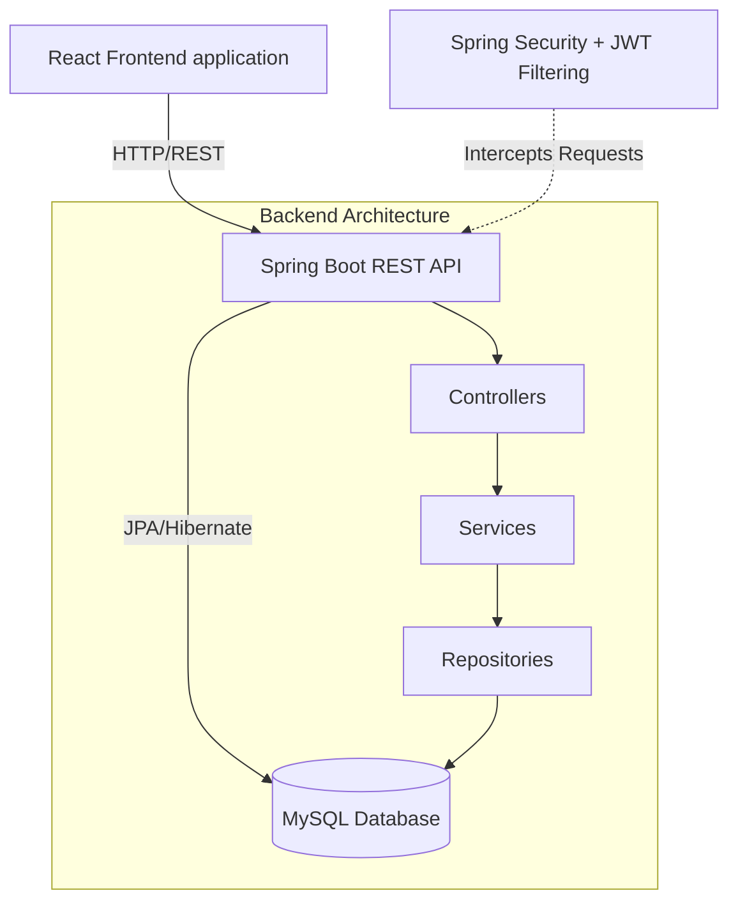
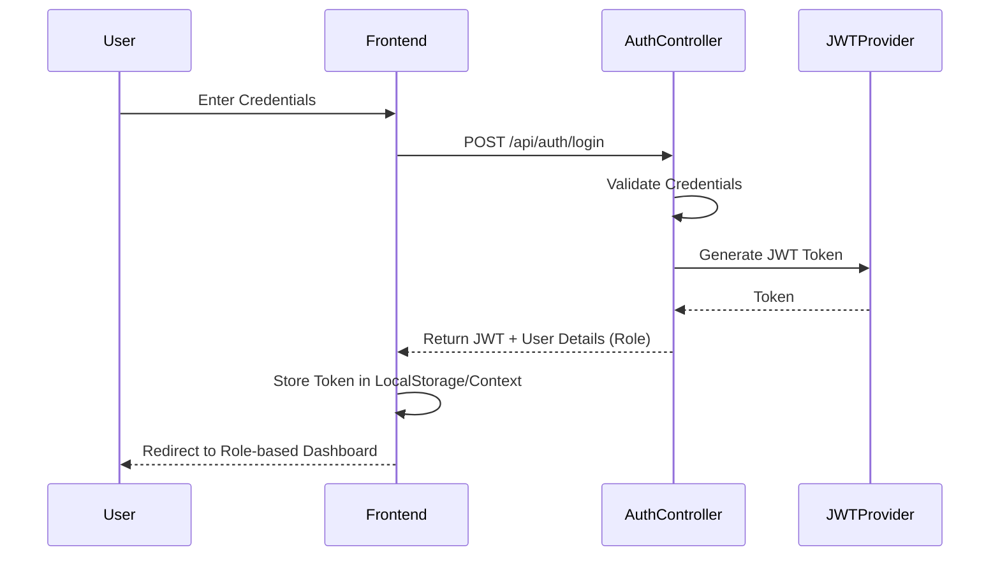
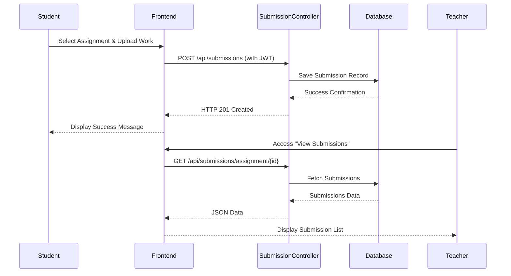

# Learning Management System (LMS) Platform

This repository contains a comprehensive Learning Management System built with a Spring Boot Java backend and a React Vite frontend. The application provides dynamic role-based access control, allowing administrators, teachers, and students to securely interact with the platform according to their granted permissions.

## Table of Contents
- [Project Overview](#project-overview)
- [Architecture](#architecture)
- [Features by Role](#features-by-role)
- [Technology Stack](#technology-stack)
- [System Flows & Diagrams](#system-flows--diagrams)
- [Project Structure](#project-structure)
- [Getting Started](#getting-started)

## Project Overview
The LMS application provides a centralized portal for educational institutions to manage courses, enrollments, and assignments. Administrators manage the platform's core entities, teachers handle course material and student evaluation, and students access their learning materials and submit assignments.

## Architecture

The system follows a standard Client-Server Architecture. 
- **Frontend Container**: A Single Page Application (SPA) built with React and Vite.
- **Backend Container**: A REST API built with Spring Boot, secured via JWT authentication.
- **Database**: Relational data store (MySQL) managed via Spring Data JPA.



## Features by Role

### Administrator
- **Dashboard**: High-level metrics and system overview.
- **Manage Users**: Create, read, update, and delete students and teachers.
- **Manage Subjects**: Create and organize subjects or courses.
- **Assignments**: Assign teachers to specific subjects.

### Teacher
- **Dashboard**: Access to assigned subjects.
- **Assignments**: Create new assignments for subjects they teach.
- **Submissions**: View assignment submissions from students and grade them.

### Student
- **Dashboard**: Overview of their current progress.
- **Course Enrollment**: Search for and enroll in available subjects.
- **My Subjects**: Access enrolled subjects.
- **Assignments**: View pending assignments, submit files/links, and view grades.

## Technology Stack

### Frontend
- **Framework**: React 19
- **Build Tool**: Vite
- **Routing**: React Router DOM (v7)
- **HTTP Client**: Axios
- **Styling**: Standard CSS / Lucide React for UI Icons

### Backend
- **Language**: Java 17
- **Framework**: Spring Boot 4.x
- **ORM**: Spring Data JPA
- **Security**: Spring Security with JWT (JSON Web Tokens)
- **Database**: MySQL (Connector/J)
- **Utilities**: Lombok for boilerplate reduction, Spring Boot Cache

## System Flows & Diagrams

### Authentication & Authorization Flow



### Assignment Submission Flow



## Project Structure

```text
.
├── frontend/                  # React Frontend Application
│   ├── public/ 
│   ├── src/
│   │   ├── api/               # Axios configuration and API calls
│   │   ├── components/        # Reusable UI components & ProtectedRoute
│   │   ├── context/           # React Context (Auth, Toast)
│   │   ├── pages/             # Route-specific pages divided by role
│   │   │   ├── admin/
│   │   │   ├── student/
│   │   │   └── teacher/
│   │   └── main.jsx           # App entry point
│   ├── package.json
│   └── vite.config.js
└── lms-java/                  # Spring Boot Backend Application
    ├── src/
    │   ├── main/
    │   │   ├── java/.../lms_java/
    │   │   │   ├── config/      # App/Security Configurations
    │   │   │   ├── controller/  # REST API Endpoints
    │   │   │   ├── dto/         # Data Transfer Objects
    │   │   │   ├── entity/      # JPA Entities
    │   │   │   ├── repository/  # Data Access Layer
    │   │   │   ├── security/    # JWT Filters and security logic
    │   │   │   └── service/     # Business Logic
    │   │   └── resources/
    │   │       └── application.properties # Database & App configs
    └── pom.xml                # Maven Dependencies
```

## Getting Started

### Prerequisites
- Node.js (v18+)
- Java JDK 17
- Maven
- MySQL Server

### Database Setup
1. Open MySQL and create a database (e.g., `lms_db`).
2. Update the `lms-java/src/main/resources/application.properties` with your MySQL credentials:
```properties
spring.datasource.url=jdbc:mysql://localhost:3306/lms_db
spring.datasource.username=root
spring.datasource.password=your_password
```

### Backend (Spring Boot)
1. Navigate to the backend directory:
   ```bash
   cd lms-java
   ```
2. Build and run the application:
   ```bash
   mvn clean install
   mvn spring-boot:run
   ```
   The backend will start, usually on `http://localhost:8080`.

### Frontend (React)
1. Open a new terminal and navigate to the frontend directory:
   ```bash
   cd frontend
   ```
2. Install dependencies:
   ```bash
   npm install
   ```
3. Run the development server:
   ```bash
   npm run dev
   ```
   The frontend will be available at standard Vite port (usually `http://localhost:5173`).

